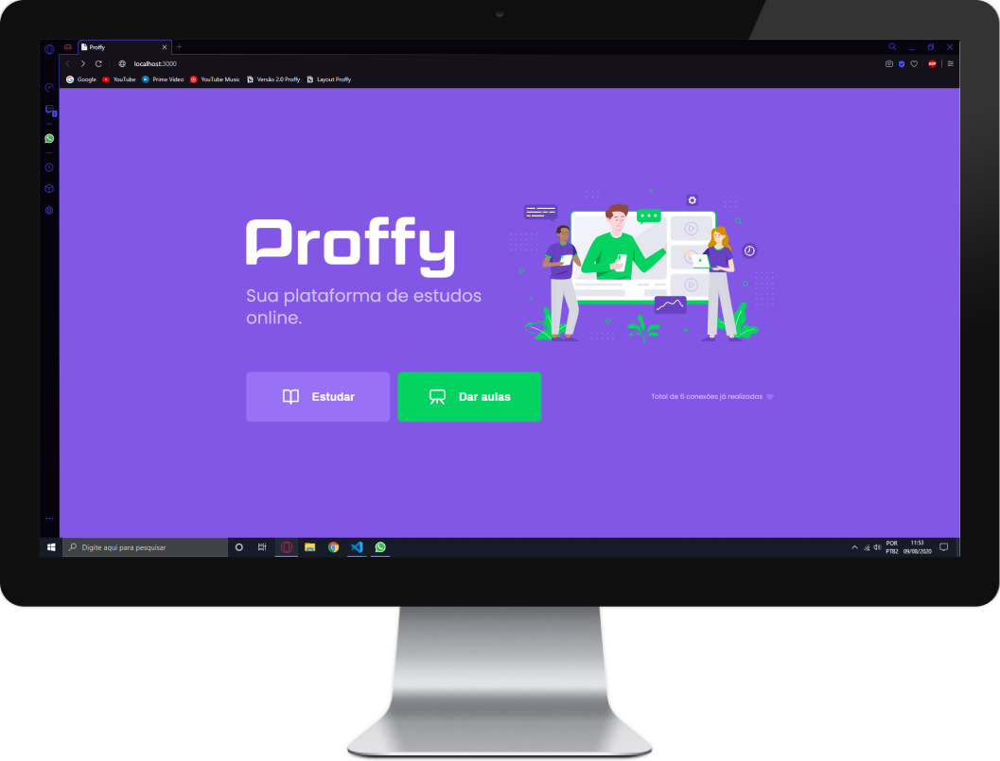
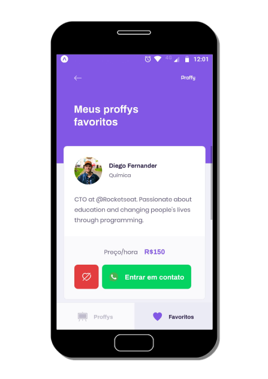

# Projeto Proffy

## Projeto da semana NLW #2

### O projeto consiste em uma plataforma onde professores se cadastram para dar aulas online e alunos conseguem encontrar esses professores através de alguns filtros e assim fazendo a conexão entre eles.

### Techs utilizadas:
<strong>#JS - Node.js - Typescript - ReactJS - React Native </strong>

### Versão WEB

### Versão Mobile

